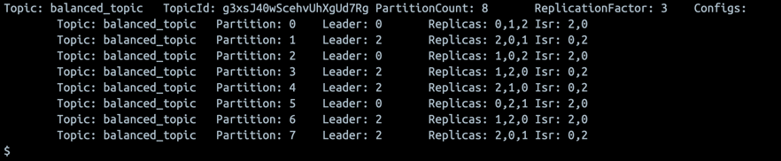

<h1>Задание 1</h1>

1. Создайте новый топик balanced_topic с 8 партициями и фактором репликации 3.
Создаем топик через консоль командой kafka-topics --create --topic balanced_topic --bootstrap-server localhost:9092 --partitions 8 --replication-factor 3
Получаем ответ о создании Created topic balanced_topic.

2. Определите текущее распределение партиций.
Выводим информацию о созданном топике kafka-topics --bootstrap-server localhost:9092 --describe --topic balanced_topic

3. Создайте JSON-файл reassignment.json для перераспределения партиций.
Создаем файл в терминале брокера kafka-0 по пути /tmp
echo '{
   "version": 1,
   "partitions": [
   {"topic": "balanced_topic", "partition": 0, "replicas": [0, 1, 2], "log_dirs": ["any", "any", "any"]},
   {"topic": "balanced_topic", "partition": 1, "replicas": [2, 0, 1], "log_dirs": ["any", "any", "any"]},
   {"topic": "balanced_topic", "partition": 2, "replicas": [1, 0, 2], "log_dirs": ["any", "any", "any"]},
   {"topic": "balanced_topic", "partition": 3, "replicas": [1, 2, 0], "log_dirs": ["any", "any", "any"]},
   {"topic": "balanced_topic", "partition": 4, "replicas": [2, 1, 0], "log_dirs": ["any", "any", "any"]},
   {"topic": "balanced_topic", "partition": 5, "replicas": [0, 2, 1], "log_dirs": ["any", "any", "any"]},
   {"topic": "balanced_topic", "partition": 6, "replicas": [1, 2, 0], "log_dirs": ["any", "any", "any"]},
   {"topic": "balanced_topic", "partition": 7, "replicas": [2, 0, 1], "log_dirs": ["any", "any", "any"]}
   ]
   }' > reassignment.json

На сервере появляется наш файл

4. Перераспределите партиции.
Создаем план переназначения партиций
   kafka-reassign-partitions.sh \
   --bootstrap-server localhost:9092 \
   --broker-list "1,2,3,4" \
   --topics-to-move-json-file "/tmp/reassignment.json" \
   --generate

Запускаем перераспределение партиций

kafka-reassign-partitions.sh --bootstrap-server localhost:9092 --reassignment-json-file /tmp/reassignment.json --execute
   
Получаем результат выполнения команды

5. Проверьте статус перераспределения.
Вновь проверяем топик на распределение партиций

   
6. Убедитесь, что конфигурация изменилась.
   
Конфигурация изменилась.

7. Смоделируйте сбой брокера:
   a.  Остановите брокер kafka-1.
   b.  Проверьте состояние топиков после сбоя.
Состояние изменилось 

   c.  Запустите брокер заново.
   d.  Проверьте, восстановилась ли синхронизация реплик.
Синхронизация восстановилась 

<h1>Задание 2</h1>

1. Создайте сертификаты для каждого брокера.

2. Создайте Truststore и Keystore для каждого брокера.

Importing keystore kafka-1-creds/kafka-1.p12 to kafka-1-creds/kafka.kafka-1.keystore.pkcs12...
Entry for alias kafka-1 successfully imported.
Import command completed:  1 entries successfully imported, 0 entries failed or cancelled

Certificate was added to keystore

echo "password" > kafka-1-creds/kafka-1_sslkey_creds
echo "password" > kafka-1-creds/kafka-1_keystore_creds
echo "password" > kafka-1-creds/kafka-1_truststore_creds

3. Настройте дополнительные брокеры в режиме SSL. Ранее в курсе вы уже работали с кластером Kafka, состоящим из трёх брокеров. 
Используйте имеющийся docker-compose кластера и настройте для него SSL.

4. Создать два топика:
topic-1
topic-2

kafka-topics \
--create \
--topic topic-1 \
--bootstrap-server localhost:9092 \
--command-config /tmp/adminclient-configs.conf \
--partitions 2 \
--replication-factor 3

kafka-topics \
--create \
--topic topic-2 \
--bootstrap-server localhost:9092 \
--command-config /tmp/adminclient-configs.conf \
--partitions 2 \
--replication-factor 3

Настроить права доступа:
topic-1: Доступен как для продюсеров, так и для консьюмеров.
topic-2:
Продюсеры могут отправлять сообщения.
Консьюмеры не имеют доступа к чтению данных.

kafka-acls --bootstrap-server localhost:9092 \
--add \
--allow-principal User:ivan \
--operation write \
--operation read \
--operation create \
--topic topic-2 \
--command-config /tmp/adminclient-configs.conf

kafka-acls --bootstrap-server localhost:9092 \
--add \
--allow-principal User:ivan \
--operation all \
--group app-group \
--command-config /tmp/adminclient-configs.conf